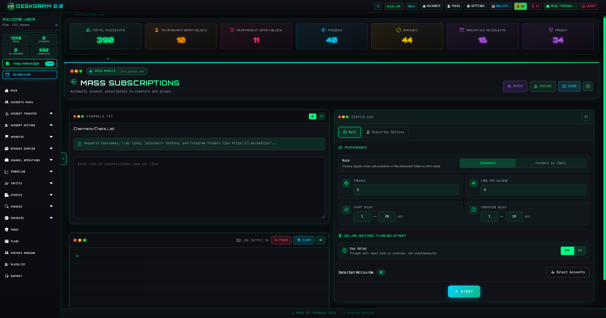
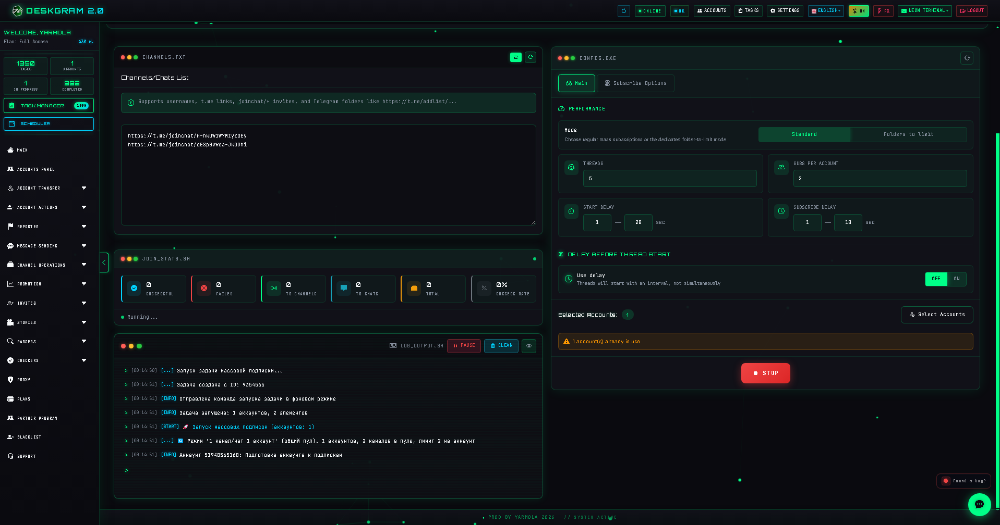
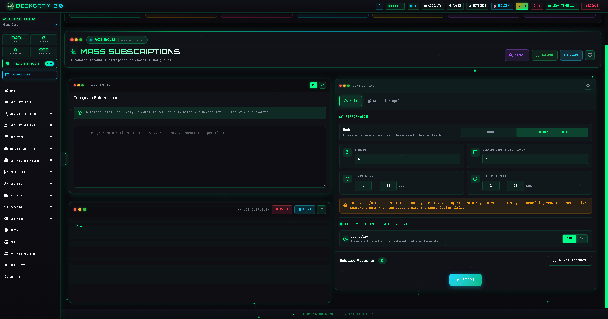
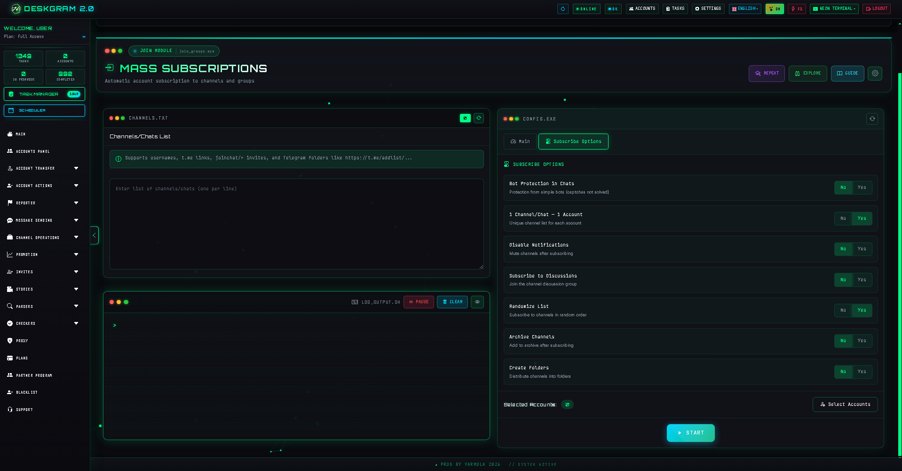

# Mass Joining in Telegram with Deskgram 2

Join Groups is a Deskgram 2 module for distributing Telegram accounts across channels, chats, and folders. It is useful when you need to prepare accounts for the next workflows, expand presence in selected communities, and build the infrastructure layer for a larger Telegram operation.

[Deskgram 2 Hub](https://github.com/Deskgram-2/deskgram-2-telegram-automation-en) · [Website](https://deskgram2.com/) · [Telegram Bot](https://t.me/DG2welcomebot) · [Web Preview](https://deskgram2.com/web-preview?path=%2Fapp-demo%2F&lang=en)
## Interactive Web Preview

Try the module interface in the browser: [Open web preview](https://deskgram2.com/web-preview?path=%2Fapp-demo%2Ffunctions%2Fjoin_groups&lang=en)

If you want to evaluate the interface before installing anything, open the web preview first: it helps you compare the module with nearby workflows and understand the section before setup.

## About the module

| Parameter | What is inside |
|---|---|
| Main task | Mass joining Telegram channels, chats, and folders |
| Important blocks | Link list, statistics, logs, joining modes, limitations |
| Useful for | Account preparation, infrastructure setup, workflow scaling |
| Related modules | Accounts Panel, Proxy, Invite |

## What it can do

- join public channels and chats;
- work with invite links and Telegram folders;
- distribute links across accounts without unnecessary overlap;
- show success, error, and progress statistics;
- apply delays, threads, and limitations for safer execution.

## Quick start

1. Prepare a list of links to channels, chats, or folders.
2. Configure the joining mode and account limits.
3. Select the accounts and proxies if needed.
4. Start the task and monitor statistics.
5. Use the prepared accounts in the next modules.

## What to combine it with

- [Account Manager](https://github.com/Deskgram-2/telegram-account-manager-deskgram-en) if the account grid is not ready yet.
- [Proxy Manager](https://github.com/Deskgram-2/telegram-proxy-manager-deskgram-en) if joining depends on a working proxy pool.
- [Audience Parser](https://github.com/Deskgram-2/telegram-audience-parser-deskgram-en) if the next step is collecting users from the joined communities.
- [Direct Messaging](https://github.com/Deskgram-2/telegram-direct-messaging-deskgram-en) if joining is only the preparation step before outreach.
- [Invite Tool](https://github.com/Deskgram-2/telegram-invite-tool-deskgram-en) if the broader growth scenario continues after the infrastructure layer is ready.

## What this infrastructure path often feeds into

- [Task Manager](https://github.com/Deskgram-2/telegram-task-manager-deskgram-en) if you want joining and next-step execution inside one control layer.
- [Automation Settings](https://github.com/Deskgram-2/telegram-automation-settings-deskgram-en) if the prepared environment should stay aligned with shared system parameters.
- [Neuro Commenting](https://github.com/Deskgram-2/telegram-neuro-commenting-deskgram-en) if community entry is only the first step before engagement activity.

## Interface highlights

### Statistics

### Main settings

### Subscription options

## How the scenario is structured

### Source list

The module starts from a base of public links, invite links, or Telegram folder links. The quality of that list affects the whole task.

### Distribution mode

Deskgram 2 can work with account-specific lists or a shared distribution logic where links are assigned across accounts without duplicates.

### Limit control

Delays, limits, and visible task statistics help reduce overload and keep the joining process easier to control.

## When it is especially useful

- before invite, warmup, or broader infrastructure workflows;
- when many accounts must be connected to selected communities;
- when joining should be managed centrally rather than manually;
- when the next modules depend on a prepared subscription layer.

## Why it is more convenient than manual joining

| Manual approach | Join Groups in Deskgram 2 |
|---|---|
| Scaling is slow | The module works across an account grid |
| Limits are hard to manage | Delays, threads, and statistics are visible |
| Source lists become chaotic fast | Link processing is centralized |
| Harder to prepare accounts for the next modules | It becomes an infrastructure layer for future workflows |

## What to choose: Join Groups or Audience Parser

| If your goal is | Better fit |
|---|---|
| Put your own accounts into selected communities first | [Join Groups](https://github.com/Deskgram-2/telegram-join-groups-deskgram-en) |
| Extract users from groups and chats | [Audience Parser](https://github.com/Deskgram-2/telegram-audience-parser-deskgram-en) |
| Build a route like `environment -> base -> outreach` | Join Groups -> Audience Parser -> Direct Messaging |
| Prepare infrastructure without parsing yet | Join Groups |

## Scenario FAQ

### When is this module best used as a standalone step?

When the goal is specifically to connect your account grid to the target environment and stop there for now. Still, the module usually creates the most value when it feeds the next workflow.

### When should I go from Join Groups into Audience Parser instead of Invite Tool?

When the next objective is to collect and segment users from the newly entered communities before you start communication or growth actions. In that route [Audience Parser](https://github.com/Deskgram-2/telegram-audience-parser-deskgram-en) is a stronger next step than Invite Tool.

### When does Join Groups work best together with warmup?

When accounts are still fresh, the environment is unstable, or you want a softer path into more active workflows. Then warmup and joining complement each other well, even if the warmup layer is outside the current EN wave.

## Related repositories

- [Deskgram 2 Hub](https://github.com/Deskgram-2/deskgram-2-telegram-automation-en)
- [Audience Parser](https://github.com/Deskgram-2/telegram-audience-parser-deskgram-en)
- [Direct Messaging](https://github.com/Deskgram-2/telegram-direct-messaging-deskgram-en)
- [Account Manager](https://github.com/Deskgram-2/telegram-account-manager-deskgram-en)
- [Proxy Manager](https://github.com/Deskgram-2/telegram-proxy-manager-deskgram-en)
- [Invite Tool](https://github.com/Deskgram-2/telegram-invite-tool-deskgram-en)
- [Task Manager](https://github.com/Deskgram-2/telegram-task-manager-deskgram-en)
- [Automation Settings](https://github.com/Deskgram-2/telegram-automation-settings-deskgram-en)
- [Neuro Commenting](https://github.com/Deskgram-2/telegram-neuro-commenting-deskgram-en)

## FAQ


### Can I look at the interface before installing anything?

Yes. This README already includes a direct web preview link, so you can open the module in the browser, inspect the section, and decide whether it matches your workflow before installation and account setup.

### Is this only for public links?

No. The module also works with invite links and Telegram folder links.

### Can I use it as a preparation step?

Yes. It is one of the most practical infrastructure modules before invite, warmup, and other next-step workflows.

